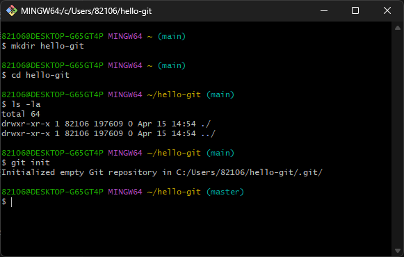

# [GIT] 02 깃으로 버전 관리하기

수업일: 2024/04/15
비고: GIT
책: 지옥에서 온 문서 관리자 깃&깃허브 입문

### 깃 초기화하기 - git init

```jsx
mkdir hello-git
cd hello-git
```

```jsx
git init
```



Initialized empty Git repository라는 메세지가 나타난다면 이제부터 해당 디렉터리에서 깃을 사용 가능


.git이라는 디렉터리 생긴 것을 확인 가능

### 스테이지와 커밋 이해하기


### 작업 트리

작업 트리(working tree)는 파일 수정, 저장 등의 작업을 하는 디렉터리로 작업 디렉터리라고도 한다.

working directory라고도 하며, 앞에서 만들었던 hello-git 디렉터리가 작업 트리가 된다.

### 스테이지

스테이지(stage)는 버전으로 만들 파일이 대기하는 곳이다. staging area라고도 한다.

예를 들어 10개의 파일을 수정했는데 4개의 파일만 버전으로 만들려면 4개의 파일만 스테이지로 넘기면 된다.

### 저장소

저장소는 스테이지에서 대기하고 있던 파일들을 버전으로 만들어 저장하는 곳이다.

### 깃이 버전을 만드는 과정

hello.txt 파일 문서를 수정하고 저장하면 그 파일은 작업 트리에 존재 → 수정한 hello.txt 파일을 버전으로 만들고 싶을 때 스테이지에 넣는다.


파일 수정을 끝내고 스테이지에 다 넣었다면 버전을 만들기 위해 깃에게 커밋(commit) 명령을 내린다. 커밋 명령을 내리면 새로운 버전이 생성되면서 스테이지에 대기하던 파일이 모두 저장소에 저장된다.


### 작업 트리에서 빔으로 문서 수정하기


On branch master : 현재 master 브랜치에 있습니다.

No commits yet : 아직 커밋한 파일이 없습니다.

nothing to commit : 현재 커밋할 파일이 없습니다.

```jsx
vim hello.txt
```


branch master에 hello.txt.라는 untracked files가 있다. 

아직 한번도 버전 관리하지 않은 파일을 untracked files라고 부른다.


현재 상태

### 수정한 파일을 스테이징하기 - git add

```jsx
git add hello.txt
```


### 스테이지에 올라온 파일 커밋하기 - git commit

깃에서 버전을 만드는 것을 간단히 커밋한다고 말한다.

```jsx
git commit -m "message1"
```


스테이지에 있던 hello.txt. 파일이 저장소에 추가된 것

nothing to commit : 버전으로 만들 파일이 없다.

working tree clean : 작업 트리도 수정사항 없이 깨끗하다.

```jsx
git log
```


### 스테이징과 커밋 한번에 처리하기 - git commit -am

commit 명령에 -am 옵션을 사용하면 스테이지에 올리고 커밋하는 과정을 한꺼번에 처리할 수 있다. 단이  방법은 한 번이라도 커밋한 적이 있는 파일을 다시 커밋할 떄만 사용할 수 있다.

```jsx
git commit -am "message2"
git log
```

### 커밋 기록 자세히 살펴보기 - git log

```jsx
82106@DESKTOP-G65GT4P MINGW64 ~/hello-git (master)
$ git lo
commit 602b63678998af0e43cc2966e0795f60abae7b6a (HEAD -> master)
Author: jinyoung0711 <ssconvergence2@gmail.com>
Date:   Mon Apr 15 15:26:37 2024 +0900

			message1
```

```jsx
commit 602b63678998af0e43cc2966e0795f60abae7b6a (HEAD -> master)

> commit hash or git hash 
  커밋을 구별하는 아이디
> HEAD -> master
  이 버전이 가장 최신이라는 표시
```

```jsx
Author: jinyoung0711 <ssconvergence2@gmail.com>
> 작성자를 의미
Date:   Mon Apr 15 15:26:37 2024 +0900
> 버전 만들 날짜를 의미
```

```jsx
message1
> 커밋 메시지
```

### 변경 사항 확인한기 - git diff


### 커밋에 관련된 파일까지 함께 살펴보기

```jsx
git log--stat
```


로그 메세지가 너무 많을 경우 한 화면씩 나누어 보여준다.

Enter를 누르면 다음 화면을 볼 수 있고, Q를 누르면 로그화면을 빠져나와 다시 깃 명령 입력 가능


### 방금 커밋한 메시지 수정하기

```jsx
git commit --amend
```

## 작업 되돌리기

### 작업 트리에서 수정한 파일 되돌리기 - git checkout

파일의 수정을 취소하고 원래대로 되돌리기

```jsx
git checkout -- hello.txt
```

### 스테이징 되돌리기 - git reset HEAD 파일 이름

수정된 파일을 스테이징했을 때, 스테이징을 취소하는 방법

```jsx
git reset HEAD hello.txt
```

### 최신 커밋 되돌리기 - git reset HEAD^

수정된 파일을 스테이징하고 커밋까지 했을 때, 가장 마지막에 한 커밋을 취소하는 방법

```jsx
git reset HEAD^
```

### 특정 커밋으로 되돌리기 - git reset 커밋 해시

```jsx
git reset --hard *복사한 커밋 해시*
```

### 커밋 삭제하지 않고 되돌리기 - git revert

```jsx
git revert *복사한 커밋 해시*
```