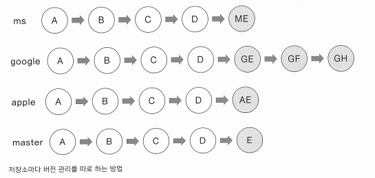

# [GIT] 03 깃과 브랜치

수업일: 2024/04/16
비고: GIT
책: 지옥에서 온 문서 관리자 깃&깃허브 입문

## 03-1 브랜치란 ?

브랜치는 원래 나뭇가지라는 뜻이다.

버전 관리 시스템에서는 나무가 가지에서 새 줄기를 뻗듯이 여러 갈래로 퍼지는 데이터 흐름을 가리키는 말로 사용한다.

저장소마다 버전 관리를 따로 하는 방법



효율적이지 않음. 버전 관리 시스템의 장점 중 하나는 파일 이름을 더럽히지 않는 것인데, 이 방법은 고객사마다 디렉터리 이름을 다르게 사용해야 한다.

### 브랜치 기능 살펴보기

깃으로 버전관리를 시작하면 기본적으로 master라는 브랜치가 만들어진다. 사용자가 커밋할 때마다 master 브랜치는 최신 커밋을 가리킨다.

즉, 브랜치는 커밋을 가리키는 포인터와 비슷하다.

새 브랜치를 만들게 되면 기존에 저장한 파일을 master 브랜치에 그대로 유지하면서 기존 파일 내용을 수정하거나 새로운 기능을 구현할 파일을 만들 수 있다. 


c1, a1 등은 커밋을 의미한다.

이렇게 mater에서 뻗어 나오는 새 브랜치를 만드는 것을 분기(branch)한다고 한다.


새 브랜치에서 원하는 작업을 다 끝냈다면 새 브랜치에 있떤 파일을 원래 master 브랜치에 합칠 수 있다. 이렇게 분기했던 브랜치를 matser 브랜치에 합치는 것을 병합한다고 한다.

## 03-2 브랜치 만들기

### 실습 상황 설정하기

```jsx
mkdir manual
cd manual
```

```jsx
git init
ls -al
```

```jsx
vim work.txt
```

```jsx
git add work.txt
git commit -m 'work 1'
```

work.txt 파일을 두 번 더 커밋. content 2 content3 동일하게 진행

```jsx
git log
```


master 브랜치는 가장 최신 커밋인 ‘work 3’를 가리키고 있고, HEAD가 master 브랜치를 가리킨다.

HEAD는 여러 브랜치 중에서 현재 작업 중인 브랜치를 가리킨다.

### 새 브랜치 만들기

```jsx
git branch
```

```jsx
git branch apple
git branch
```


터미널 창에 나타나는 (master) 표시도 현재 브랜치가 master라는 뜻을 의미

apple 브랜치와 master 브랜치가 있는 것을 확인 가능

master 브랜치 앞에 * 표시는 master 브랜치에서 작업중을 의미

```jsx
git log
```


(HEAD → master, apple)은 2개의 브랜치가 존재하고, 현재 작업 중인 브랜치는 master 브랜치임 의미

같은 방법으로 google 브랜치와 ms 브랜치 만들어보기

```jsx
git branch google
git branch ms
git branch
```

### 브랜치 사이 이동하기 - git checkout


master 브랜치를 비롯해 ms, google, apple 브랜치가 ‘work 3’ 커밋 상태에서 만들어짐. 이것은 모든 브랜치에 최신 커밋이 ‘work 3’임을 의미.

```jsx
vim work.txt <- work.txt에 'master content 4' 추가 입력 후 저장
git commit -am 'master content 4'
```

```jsx
git log --oneline
```


master work 4 → master branch의 최신 커밋

work 3 → ms, google, apple의 최신 커밋 

```jsx
git checkout apple
git log --oneline
```


최신 커밋 해시에서 HEAD가 apple을 가리키고 있음.

apple 브랜치가 matser 브랜치에서 분기된 이후에 master 브랜치에 추가된 커밋은 apple 브랜에 영향을 미치지 않음.

## 03-3 브랜치 정보 확인하기

### 새 브랜치에서 커밋하기

```jsx
vim work.txt <- work.txt에 'apple content 4' 추가 입력 후 저장
vim apple.txt <- apple.txt에 'apple content 4' 추가 입력 후 저장
```

```jsx
git add .
git commit -m 'apple content 4'
git log --oneline
```


HEAD → apple은 현재 apple 브랜치에 체크아웃한 상태임을 의미

apple 브랜치의 최신 커밋은 ‘apple content 4’

```jsx
git log --oneline --branches
```

 

```jsx
git log --oneline --branches --graph
```


| 수직선은 커밋과 커밋의 관계를 보여줌

apple 브랜치의 최신 커밋은 ‘apple content 4’인데 점선을 따라가면 ‘work 3’ 커밋을 만나게 된다. 

즉, apple 브랜치에서는 ‘work 3’ 커밋 다음에 ‘apple content 4’ 커밋이 만들어짐.

master 브랜치의 경우 최신 커밋은 ‘master content 4’이고 수직선을 따라가보면 ‘work 3’ 커밋

apple 브랜치와 master 브랜치는 커밋이 같은 부모 커밋을 갖고 있다.

### 브랜치 사이의 차이점 알아보기

브랜치마다 커밋이 점점 쌓여갈수록 브랜치 사이에 어떤 차이가 있는지 확인하기 어렵다.

이럴 때는 브랜치 이름 사이에 마침표 두개 넣는 명령으로 차이점을 쉽게 확인 가능하다.

```jsx
git log master..apple <- master 브랜치에는 없고 apple 브랜치에만 있는 커밋
git log apple.master <- apple 브랜치에는 없고 master 브랜치에만 있는 커밋
```


마침표 왼쪽에 있는 브랜치를 기준으로 오른쪽 브랜치와 비교

## 03-4 브랜치 병합하기

### 서로 다른 파일 병합하기

```jsx
cd ~
git init manual-2
cd manual-2
ls -al
```

```jsx
vim work.txt <- work.txt라는 파일을 만들어 '1' 입력하고 저장
git add work.txt
git commit -m 'work 1'
```


```jsx
git branch o2
```


```jsx
vim master.txt <- master.txt라는 파일을 만들어 'master 2' 입력하고 저장
git add master.txt
git commit -m 'master work 2'
```


```jsx
git checkout o2
```

```jsx
vim o2.txt <- o2.txt 파일을 만들어 'o2 2' 입력하고 저장
git add o2.txt
git commit -m 'o2 work 2'
```


o2 브랜치의 내용을 master 브랜치로 병합

브랜치를 병합하기 위해서는 먼저 master 브랜치로 체크아웃

```jsx
git checkout master
git merge o2
```


병합된 것과 어떻게 병합되었는지 확인 가능

### 빨리 감기 병합

master 브랜치에서 브랜치를 분기한 후에 master 브랜치에 아무 변화가 없다면 분기한 브랜치를 병합하는 것은 간단하다.

분기한 브랜치에서 만든 최신 커밋을 master 브랜치가 가리키게만 하면 되기 때문이다.

이 경우에는 화면에 커밋 해시가 업데이트되었다는 내용과 함께 fast-forward라는 메시지가 나타난다. 이런 병합을 빨리 감기 병합이라고 부른다. 

### 브랜치를 병합할 떄 편집기 창이 열리지 않게 하려면

```jsx
git merge o2 --no-edit
```

```jsx
git merge o2 --edit
```

### 같은 문서의 다른 위치를 수정했을 때 병합하기

master 브랜치와 o2 브랜치에는 똑같이 work.txt 파일이 존재 

양쪽 브랜치에서 수정하되 서로 다른 위치를 수정한 후 브랜치를 병합했을 때 어떤 결과가 나오는지 확인

```jsx
cd ~ 
git init manual-3
cd manual-3
```

```jsx
vim work.txt 
```


```jsx
git add work.txt
git commit -m 'work 1'
```

```jsx
git branch o2
vim work.txt <- 첫 번째 content 다음에 master content 2 입력 후 저장
git commit -am 'master work 2'
```

```jsx
git checkout o2
vim work.txt <- 두 번째 content 다음에 o2 content 2 입력 후 저장
git commit -am 'o2 work 2'
```

```jsx
git checkout master
git merge o2 
cat work.txt
```


자연스럽게 하나의 파일에 합쳐진 것을 볼 수 있다.

### 같은 문서의 같은 위치를 수정했을 때 병합하기

```jsx
cd ~ 
git init manual-4
cd manual -4
```

```jsx
vim work.txt 
```


```jsx
git add work.txt
git commit -m 'work 1'
```

```jsx
git branch o2
vim work.txt <- 첫 번째 content 다음에 master content 2 입력 후 저장
git commit -am 'master work 2'
```

```jsx
git checkout o2
vim work.txt <- 같은 위치 o2 content 2 입력 후 저장
git commit -am 'o2 work 2'
```

```jsx
git checkout master
git merge o2 
```


이전에 git merge 명령을 실행했을 때처럼 자동으로 빔이 열리지 않고 메시지가 나타난다. 이 메시지는 work.txt를 자동 병합하는 동안 충돌(conflict)이 발생했다는 뜻이다.

충돌이 생긴 문서는 자동으로 병합될 수 없으므로 사용자가 직접 충돌 부분을 해결한 후 커밋해야 한다. 

```jsx
vim work.txt
```


```jsx
# title
content
<<<<<<< HEAD
master content 2 -> 현재 브랜치에서 수정한 내용
=======
o2 content 2 -> 병합할 브랜치에서 수정한 내
>>>>>>> o2
# title
content

```

```jsx
git commit -am 'merge o2 branch'
```

git log 명령에 —oneline, —branches, —graph 옵션을 사용하여 관계 확인 가능

### 병합이 끝난 브랜치 삭제하기

단 이렇게 브랜치를 삭제하더라도 이 브랜치가 완전히 지워지는 것이 아니라 다시 같은 이름의 브랜치를 만들면 예전 내용을 다시 볼 수 있다.

```jsx
git branch
```

브랜치를 삭제하기 위해서는 master 브랜치에서 해야한다.

```jsx
git checkout master
git branch -d o2
```

master 브랜치에 병합하지 않은 브랜치를 삭제하려면 오류메세지가 나타난다. 이럴 경우 -d 옵션 대신 -D를 사용하면 강제로 브랜치를 삭제할 수 있다.