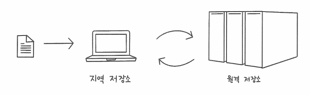

# [GIT] 04 깃허브로 백업하기

수업일: 2024/04/20
비고: GIT
책: 지옥에서 온 문서 관리자 깃&깃허브 입문

## 04-1 원격 저장소와 깃허브

### 원격 저장소란

깃에서는 지역 저장소와 원격 저장소(remote repository)를 연결해서 버전 관리하는 파일들을 쉽게 백업할 수 있다. 원격 저장소란 컴퓨터나 서버에 만든 저장소를 말한다.



## 04-2 깃허브 시작하기

### 깃허브 repository 생성 용어 정리

1. Repository name : 저장소 이름을 입력. 영문과 숫자, 언더바(_), 붙임표(-) 등을 사용할 수 있으며 공백이 포함되어 있을 경우 깃허브에서 공백을 자동으로 붙임표(-)로 바꾼다.
2. Description : 저장소에 대한 간단한 설명 입력. 
3. Public / Private : 저장소를 공개로 할지 비공개로 할지 선택.
4. Initialize this repository with a README : 저장소에 대한 소개와 설명을 작성하는 README 파일을 자동으로 만들려면 체크.
5. Add .gitignore : [▼]를 누른 후 어떤 언어와 관련된 것들을 .gitignore 파일에 지정할지 선택
6. Add a License : 오픈 소스 프로젝트를 위한 저장소를 만들 경우 해당 오픈 소스의 라이선스를 선택.

```jsx
https://github.com/아이디/저장소명
```

```jsx
https://github.com/jinyoung0711/test-1
```

## 04-3 지역 저장소를 원격 저장소에 연결하기

### 지역 저장소 만들기

```jsx
git init loc-git
cd loc-git
vim f1.txt <- a 입력 후 저장
```

```jsx
git add f1.txt
git commit -m "add a"
git log
```

### 원격 저장소에 연결하기

(커맨드 라인에서 기존 저장소를 푸시하는 방법)

```jsx
git remote add origin https://github.com/jinyoung0711/test-1.git
```

원격 저장소에 origin을 추가하겠다는 의미이다.

origin은 깃허브 저장소 주소를 가리킨다.

```jsx
git remote -v
```


## 04-4 원격 저장소에 올리기 및 내려받기

지역 저장소의 소스 → 원격 저장소 올리는 것 : push

원격저장소 → 지역저장소 내려받는 것 : pull

### 원격 저장소에 파일 올리기 - git push

```jsx
git push -u origin master
```

```jsx
vim f1.txt <- b 추가
git commit -am "add b"
git push
```

### 깃허브 사이트에서 직접 커밋하기


Add file → Create a new file 


### 원격 저장소에서 파일 내려받기 - git pull

원격 저장소에 있는 소스 파일을 다른 사용자가 수정했거나 깃허브 사이트에서 직접 커밋한 경우 지역 저장소와 차이가 생긴다. 이럴 때는 원격 저장소와 지역 저장소의 상태를 같게 만들기 위해 원격 저장소의 소스를 지역저장소로 가져온다.

 

```jsx
ls
git pull origin master
git log
```


ls를 통해 확인결과 지역저장소에는 f1.txt만 존재 → pull해주기


## 깃허브에 SSH 원격 접속하기

SSH는 Secure Shell의 줄임말로 보안이 강화된 안전한 방법으로 정보를 교환하는 방식.

SSH에서는 기본적으로 프라이빗 키와 퍼블릭 키를 한 쌍으로 묶어서 컴퓨터를 인증한다. 퍼블릭 키는 외부로 공개되는 키이고, 프라이빗 키는 아무도 알 수 없게 사용자 컴퓨터에 저장되는 키이다.

### SSH 키 생성하기

홈 디렉터리에서 해당 코드 입력

```jsx
ssh-keygen
```


두번 더 엔터를 누르면 SSH를 통해 다른 컴퓨터에 접속할 수 있는 비밀번호가 생성된다.

이 키들이 .ssh 디렉터리에 저장되었는지 확인

```jsx
cd ~/.ssh
ls -la
```


id_rsa는 프라이빗 키, id_rsa.pub는 퍼블릭 키를 의미

### 깃허브에 퍼블릭 키 전송하기

사용자 컴퓨터에서 깃허브 저장소에 접속하면 사용자 컴퓨터에 있는 프라이빗 키와 깃허브 서버에 있는 퍼블릭 키를 비교한다. 퍼블릭 키와 프라이빗 키는 한 쌍이므로 두개의 키가 서로 맞으면 사용자 컴퓨터와 깃허브 저장소가 연결된다.

```jsx
cd ~/.ssh
cat id_rsa.pub
```


New SSH 누르고 Copy한 퍼블릭 키 붙히기

### SSH 주소로 원격 저장소 연결하기

새로운 repository 만든 후 SSH 주소 복사

```jsx
cd ~
git init connect-ssh
cd connect-ssh
```

```jsx
git remote add origin *복사한 주소*
```

```jsx
git remote -v
```

원격저장소를 사용하는 동안 로그인 정보를 요구하지 않기 때문에 더더 편하게 푸시나 풀을 할 수 있다.