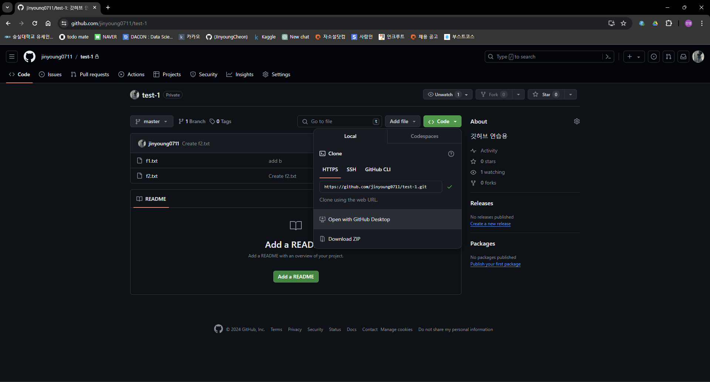

# [GIT] 05 깃허브로 협업하기

수업일: 2024/04/21
비고: GIT
책: 지옥에서 온 문서 관리자 깃&깃허브 입문

## 05-1 여러 컴퓨터에서 원격 저장소 함께 사용하기

### 원격 저장소 복제하기 - git clone

원격 저장소를 기존에 연결된 지역 저장소 외에 다른 지역 저장소에서 사용하려면 원격 저장소에 담긴 내용 전체를 지역저장소로 가져와야 한다.

원격 저장소를 지역 저장소로 똑같이 가져오는 것을 클론(clone), 클로닝(cloning)이라고 한다.



원격 저장소의 내용을 git_home과 git_office로 복제

```jsx
git clone https://github.com/jinyoung0711/test-1.git git_home
```

```jsx
git clone https://github.com/jinyoung0711/test-1.git git_office
```

git_home과 git_office 디렉터리에 같은 내용이 저장되어 있는지 확인

```jsx
cd git_home
git log
```

```jsx
cd ..
cd git_office
git log
```

```jsx
git remote -v
```


### 개인 컴퓨터에서 작업하고 올리기

```jsx
cd ~ 
cd git_home
vim f1.txt <- c 문자 추가 후 종료
```

```jsx
git commit -am "add c"
git push
```

원격 저장소에서 제대로 커밋이 올라왔는지 확인


```jsx
vim f1.txt <- d 문자 추가 후 종료
```

### 회사 컴퓨터에서 내려받아 작업하기


다시 개인 컴퓨터에서 작업할 때는 git pull 명령으로 원격 저장소에 있는 최신 커밋을 가져와 작업을 시작한다.

```jsx
cd ~/git_home
git pull
git log
```


## 05-2 원격 브랜치 정보 가져오기

## 05-3 협업의 기본 알아보기

## 05-4 협업에서 브랜치 사용하기